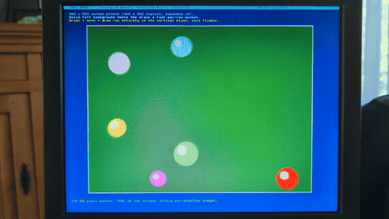

# Japi Base — Jan's Pico Projects Base

A well-documented, hackable retro computer built on a **Raspberry Pi Pico 2
(RP2350)**. Japi Base provides all the basic I/O of a small computer — video,
keyboard, storage and sound — on a single core and a single PIO block, leaving
the **second core and the remaining PIOs completely free for your own
programs**.

The goal is a system that is both educational and genuinely usable: clear
code, honest documentation, and no hidden defects.

> **Status:** the hardware platform (VGA, PS/2 keyboard, SD card, audio and a
> switchable CPU clock) is working and verified on real hardware. A code editor
> and a BASIC are planned as next steps.

The complete **[Japi Base Manual](MANUAL.pdf)** (PDF) walks through building the
board, the full C API and the demo.

## Features

- **VGA output** — 1024×768 @ 60 Hz (exact VESA timing). Text mode of
  127 columns × 64 rows, 64 colours for both foreground and background,
  8×12 pixel font (code page CP437, including box-drawing glyphs).
- **Bitmap graphics** — a character-aligned bitmap window overlaid on the text
  screen. The buffer is capped at ~128 KB: up to 416×312 logical pixels at
  scale 1, or an almost full-screen 832×624 via 2×2 pixels at scale 2.
- **PS/2 keyboard** — QWERTY_US built in; any other layout (AZERTY, QWERTZ, …)
  loads from a `<name>.kbd` file named in `config.sys` on the SD card or the
  built-in media.
- **Storage** — a 360 KB LittleFS area on the Pico's flash (always available)
  plus an optional micro-SD card when inserted, behind one unified DOS-style
  file API (`A:` = removable SD card, `C:` = built-in media). Both file I/O
  (`japi_fopen` /
  `japi_fread` / …) and directory listing (`japi_opendir` / `japi_readdir`)
  are provided in the same API.
- **Audio** — PWM stereo output with a built-in 4-channel wavetable synth
  (ADSR envelopes, volume/pan); advanced users can fill the sample buffer
  themselves.
- **Switchable CPU clock** — three voltage-tracked speeds, selectable at runtime
  and persisted in flash: 260 MHz (1.15 V), the default 324 MHz (1.20 V) and an
  opt-in 390 MHz (1.30 V) up-size. The VGA dot clock stays 65 MHz on every tier
  so the picture never changes. A board that cannot hold a speed is caught by the
  watchdog and steps down one tier on its own (390→324, 324→260) — no re-flash
  and no bricking.
- **Free for your code** — Core 0 and the unused PIOs/peripherals are entirely
  yours; the base I/O engine lives on Core 1 + PIO0.

## Demo application

**Just want to try it?** Grab the prebuilt `japi_base.uf2` from the
[**Releases**](https://github.com/JanFromBelgium/japi-base/releases) page, hold
**BOOTSEL** while plugging in your Pico 2, and copy the file onto the
`RP2350` drive that appears. (Or build it yourself — see *Building* below.)

The bundled firmware (`Japi Base Pico 2/demo.c`) cycles through, advancing on
any key:

1. **Showcase** — colour palette, full character set, windows, text colours,
   runtime font redefinition, bar chart, a scale-1 bitmap drawing the four
   synth waveforms, and 4-channel stereo music (Tetris theme).
2. **Bouncing balls** — flicker-free animation on a solid felt background
   (832×624 screen pixels, scale 2).
3. **The Starry Night** — Van Gogh, Floyd–Steinberg dithered into the
   64-colour palette (public domain, Google Art Project).
4. **API quick reference** — live keyboard test and code examples.
5. **CPU benchmark** — a fixed integer workload timed with a clock-independent
   timer; press **Shift+T** / **t** to up- and down-size the CPU clock and watch
   the throughput scale across 260 / 324 / 390 MHz while the checksum stays
   identical (proof the silicon is still computing correctly at speed).

Running on a real VGA monitor. *The picture on the monitor is razor-sharp;
any blur in these photos is the camera, not the hardware.*


*Showcase: palette, character set, waveform bitmap and 4-channel music.*



*Bouncing balls — flicker-free on a solid felt background.*
[▶ Full video (14 MB MP4)](https://github.com/JanFromBelgium/japi-base/releases/download/v0.1/japi-bouncing-balls.mp4)


*The Starry Night, Floyd–Steinberg dithered into the 64-colour palette.*


*API quick reference with a live keyboard test.*

## Hardware

All Japi Base I/O sits on the **left** side of the Pico 2 (USB at top); the
right side (GP16–GP28) stays completely free for your projects. Build it on a
breadboard, flash `japi_base.uf2`, and you can see and hear the demo.
**You need a Raspberry Pi Pico 2!**


*The prototype on perfboard: Pico 2, VGA DAC, PS/2 level shifter,
micro-SD adapter and reset button.*

| GPIO | Function | Series resistor |
|---|---|---|
| GP0 | VGA VSYNC | 100 Ω |
| GP1 | VGA HSYNC | 100 Ω |
| GP2 / GP3 | Blue LSB / MSB | 1 kΩ / 470 Ω |
| GP4 / GP5 | Green LSB / MSB | 1 kΩ / 470 Ω |
| GP6 / GP7 | Red LSB / MSB | 1 kΩ / 470 Ω |
| GP8 / GP9 | Audio L / R | see filter below |
| GP10–GP13 | SD SCK / MOSI / MISO / CS (SPI1) | — |
| GP14 / GP15 | PS/2 CLK / DATA (via level shifter) | — |
| GP16–GP28 | **free for your code** | — |

### Schematic


*The complete Japi Base schematic — VGA, PS/2 (with 5 V / 3.3 V keyboard level select), microSD, stereo audio and a GPIO breakout. [Download as PDF](Japi_Base_schematic.pdf).* See the **[Japi Base Manual](MANUAL.pdf)** for the full build walk-through.

### VGA — weighted-resistor DAC

Two GPIO bits per colour drive a VGA input (75 Ω terminated); sync lines go
straight out through a 100 Ω series resistor.

```
GP7 (Red MSB) ──[470Ω]──┐
GP6 (Red LSB) ──[1kΩ ]──┴──> VGA pin 1  (Red)

GP5 (Grn MSB) ──[470Ω]──┐
GP4 (Grn LSB) ──[1kΩ ]──┴──> VGA pin 2  (Green)

GP3 (Blu MSB) ──[470Ω]──┐
GP2 (Blu LSB) ──[1kΩ ]──┴──> VGA pin 3  (Blue)

GP1 (HSYNC)   ──[100Ω]─────> VGA pin 13 (HSYNC)
GP0 (VSYNC)   ──[100Ω]─────> VGA pin 14 (VSYNC)

Pico GND ──> all VGA ground pins (5,6,7,8,10) + the connector's metal shell
```

Per-channel voltage into 75 Ω: `00`=0.00 V, `01`=0.20 V, `10`=0.43 V,
`11`=0.63 V (within the 0.7 V VGA spec) → 64 colours.

### Audio — PWM + RC filter (per channel)

```
GP8 (L) / GP9 (R) ──[1kΩ]──┬──[10µF]──> audio out (to powered speakers)
                            │
                          [3.3nF]
                            │
                           GND
```

1 kΩ + 3.3 nF low-pass (~48 kHz cutoff) smooths the 40 kHz PWM; the 10 µF
capacitor blocks DC. Designed for active (amplified) PC speakers.

### PS/2 keyboard — via logic-level shifter

The keyboard runs at 5 V; a **bidirectional logic-level shifter** sits between
it and the Pico (3.3 V side). The open-collector pull-ups are provided on the
level-shifter module.

```
Keyboard 5V side          Level shifter          Pico 3.3V side
  PS/2 CLK   ───────────── HV1 ── LV1 ───────────── GP14
  PS/2 DATA  ───────────── HV2 ── LV2 ───────────── GP15
  +5V ── HV   ,   3.3V ── LV   ,   GND ── GND (common)
```

### Micro-SD — SPI1 (no level shifter)

A micro-SD-to-SD adapter with wires soldered straight to the Pico (the card is
3.3 V native). A 100 nF capacitor decouples the adapter's supply.

```
GP10 ── SCK      GP11 ── MOSI (DI)      GP12 ── MISO (DO)
GP13 ── CS       3.3V ──┬── VCC         Pico GND ── GND
                       [100nF]
                         │
                        GND
```

Card-detect is intentionally disabled (a background IRQ would disturb the VGA
scanline timing). The SD card is optional — the system boots from the built-in
media without it.

### Reset button

A momentary button pulls the Pico 2 **RUN** pin to GND, with a 100 nF
capacitor for debounce (the standard Pico reset circuit).

```
RUN ──┬── [button] ── GND
      │
   [100nF]
      │
     GND
```

## Timing & memory budget

- The figures below are for the **260 MHz baseline tier**; the higher tiers
  keep the same 65 MHz dot clock but give your code proportionally more
  cycles per scanline.
- At 260 MHz the PIO runs 4 ticks/pixel (divider 1:1) → exact **65 MHz**
  pixel clock for 1024×768@60 Hz. At 324 / 390 MHz the PIO divider is
  retuned so the dot clock stays 65 MHz and the picture is unchanged.
- 806 scanlines × 60 Hz ≈ **5374 CPU cycles per scanline** for the base
  engine (rendering + keyboard + audio) at the 260 MHz baseline.
- Audio: PWM at 40 kHz, sample rate **24 180 Hz** (one sample every two
  scanlines) to keep per-scanline IRQ work bounded.
- Bitmap buffer cap: **128 KB** (`JAPI_BITMAP_MAX_RAM`). The demo's full-screen
  Starry Night uses 416×312 = 129 792 bytes at scale 2.
- The scanline buffers and the whole render path live in RAM, so LittleFS
  flash writes never disturb the video signal.

## Building

Requirements: Raspberry Pi Pico SDK 2.x (`PICO_SDK_PATH` set), CMake, Ninja,
`arm-none-eabi-gcc`. Third-party libraries (FatFs_SPI, pico-lfs/littlefs) are
vendored, so no extra fetching is needed.

```sh
cd "Japi Base Pico 2"
mkdir -p build && cd build
cmake -G Ninja ..
ninja
```

Flash by holding **BOOTSEL** while plugging in the Pico 2, then:

```sh
cp "Japi Base Pico 2/build/japi_base.uf2" /media/<user>/RP2350/
```

## Hello, Japi Base

```c
#include "japi_base.h"

int main(void) {
    japi_init();                                  // clock, VGA, keyboard, SD
    vga_clear(VGA_WHITE, VGA_DARK_BLUE);
    vga_print(2, 4, "Hello from Japi Base!", VGA_YELLOW, VGA_DARK_BLUE);
    japi_play(NOTE_C5, 200);                      // a short beep

    for (;;) {
        vga_update();                        // publish writes to the screen
        if (japi_has_char()) {
            uint16_t k = japi_get_char();
            if (k == JAPI_KEY_ESCAPE) break;
        }
    }
    return 0;
}
```

`vga_set_char` / `vga_print` / `vga_clear` write into a back buffer; the
scanline reads from a separate front buffer. `vga_update()` swaps
them during the vertical blanking interval, so each frame is shown
atomically (no tearing, no half-finished updates), and your render can
take longer than a single frame without consequence. The convention is
familiar from SDL's `SDL_RenderPresent` or OpenGL's `glSwapBuffers`:
write freely, then present once per frame.

### Switching the CPU clock

The CPU speed is part of the API. `japi_set_cpu_clock(mhz)` stores the choice and
reboots to apply it cleanly (swapping the VGA program so the picture is
unchanged); after boot you can read back what the board is actually running:

```c
int mhz = japi_get_cpu_clock_mhz();      // 260, 324 or 390
if (japi_clock_was_reverted())           // the requested tier was unstable here,
    mhz = japi_clock_reverted_from();    // so the watchdog stepped down a tier

japi_set_cpu_clock(390);                 // persist + reboot into the high gear
```

A board that cannot hold the requested speed is rescued automatically by the
watchdog, so `japi_set_cpu_clock` is always safe to call — the worst case is a
brief reboot that lands one tier lower.

## Repository layout

| Path | Contents |
|---|---|
| `Japi Base Pico 2/` | The complete Pico 2 firmware (engine + demo) |
| `keyboard layouts/` | Ready-made `.kbd` files for non-US keyboards, selected via `config.sys` (see the manual) |
| `images/` | Screenshots and GIFs used in this README |
| `LICENSE` | GNU GPL v3 |
| `README.md` | This file |
| `context.md` | Project conventions and workflow for AI-assisted coding |

### Firmware files (`Japi Base Pico 2/`)

| File | Purpose |
|---|---|
| `japi_base.c` / `.h` / `.pio` | The core engine: VGA output, keyboard input, audio output and file I/O |
| `demo.c` / `demo.h` | Demo application (showcase, bouncing balls, Starry Night, API reference, CPU benchmark) and its dithered demo image |
| `third_party_libs.c` / `.h` | Third-party libraries needed by the core engine — FatFs (ChaN), SD-over-SPI driver (carlk3), littlefs, pico-lfs — all consolidated, with per-component licence headers and the SD/SPI pin glue at the bottom |
| `font_8x12.h` | 8×12 bitmap font, CP437 + box-drawing glyphs |
| `japi_kbd_defaults.h` | The built-in QWERTY_US keyboard layout (other layouts load from a `.kbd` file on the media) |
| `CMakeLists.txt`, `pico_sdk_import.cmake` | Build configuration / Pico SDK loader |

The previous Pico 1 (RP2040) prototype is archived outside this repository.

## Versioning

Japi Base uses a Linux-style even/odd version scheme, so the version number
alone tells you whether a release is stable or experimental:

- **Even major versions are production releases** — stable and ready to build
  on (2.0, 2.2, 4.0 …). Bugfix-only updates increment the minor number
  (2.0 → 2.1 → 2.2).
- **Odd major versions are development releases** — work in progress on new
  platform features (3.0, 3.1 …). When that work is finished and stable it
  graduates to the next even production version.

This scheme covers **Japi Base the platform only** — the I/O engine in this
repository. Japi Base is meant to be built on: you can write your own program
on top of it without anything else. Separate products that build on Japi Base
— the **Japi Base Editor (JBE)** and a BASIC, together forming the full
**Japi Base Computer** — live in their own repositories and carry their own
version numbers. They never bump the Japi Base version on their own; the
platform only gets a new release when the platform itself changes (for
example, a fix in the engine that every application benefits from).

## Roadmap

- A keyboard-only code editor (QuickBASIC/Turbo-Pascal look and feel) on Core 0,
  offering intellisense, split-screen editing, find and replace.
- Port a BASIC (MMBasic candidate)
- Integrate my japiZ80 assembler.
- A Z80 emulator
- A build/usage manual once the feature set is stable.

## Contributing

Japi Base is meant to be forked and built on. If you make something with it, I'd
love to hear about it.

- **Found a bug, or have a suggestion?** Open an
  [issue](https://github.com/JanFromBelgium/japi-base/issues).
- **Want to improve the platform?** Pull requests are welcome — you don't have to
  be an expert to send one. Japi Base itself is written in collaboration with an
  AI assistant, so we're all learning here.
- **Built a layout, a demo or an app on top of it?** Tell me in an issue; I enjoy
  seeing where people take it.

For a larger change, opening an issue to discuss it first is usually the
smoothest path.

## Credits

- **FatFs_SPI** — SD card over SPI, by carlk3.
- **pico-lfs** — LittleFS for RP2040/RP2350, by Timo Kokkonen.
- **littlefs** — the littlefs project.
- *The Starry Night* (Vincent van Gogh, 1889) — public domain, via Wikimedia
  Commons / Google Art Project.

## License

Released under the **GNU General Public License v3 or later** — see
[`LICENSE`](LICENSE) for the full text.

The third-party libraries consolidated into `third_party_libs.c` keep their
original notices (visible in the licence block at the top of that file):

- **FatFs** (ChaN) — BSD 1-clause style
- **SD-over-SPI driver** (Carl John Kugler III) — Apache 2.0
- **littlefs** — BSD-3-Clause
- **pico-lfs** (Timo Kokkonen) — GPL-3.0-or-later

The GPL-3 component (pico-lfs) is what makes the combined Japi Base binary
GPL-3 as distributed.
